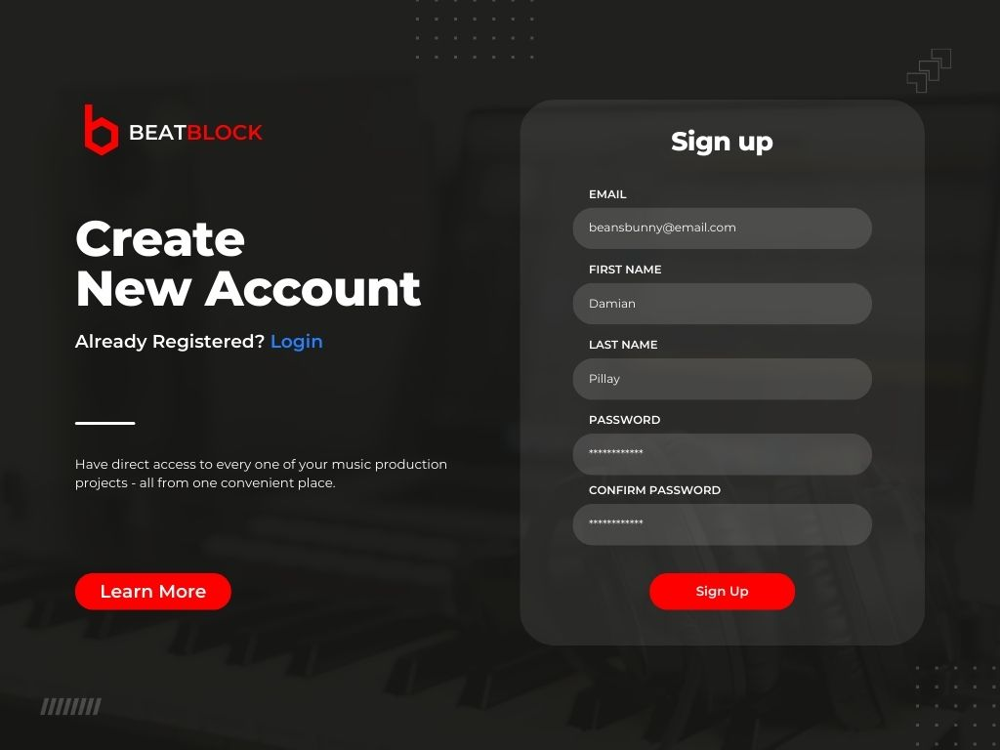
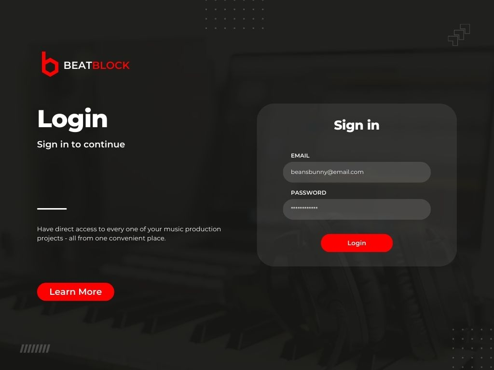
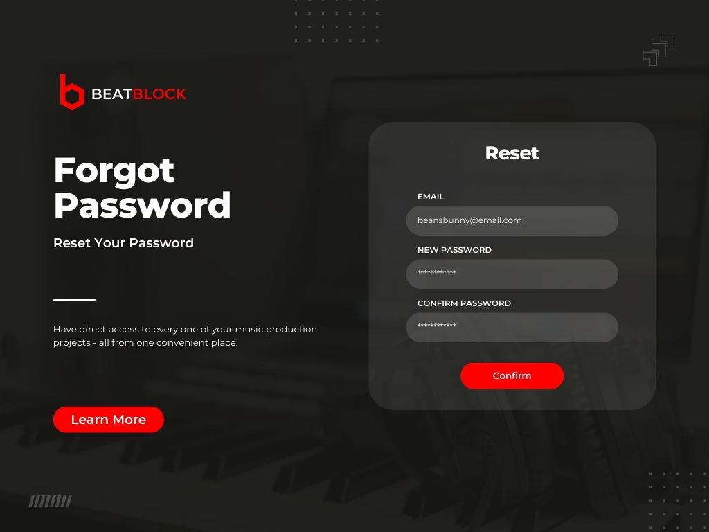
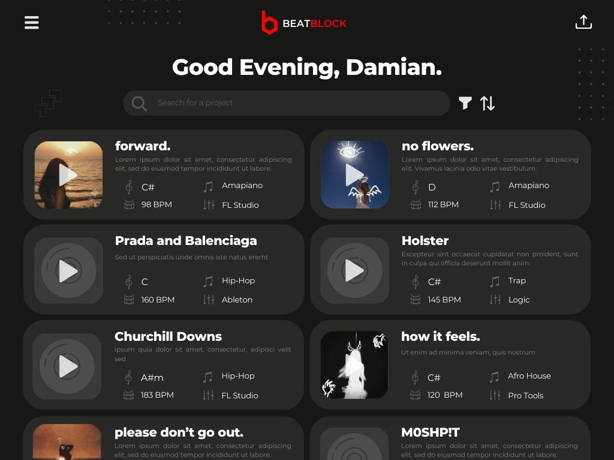
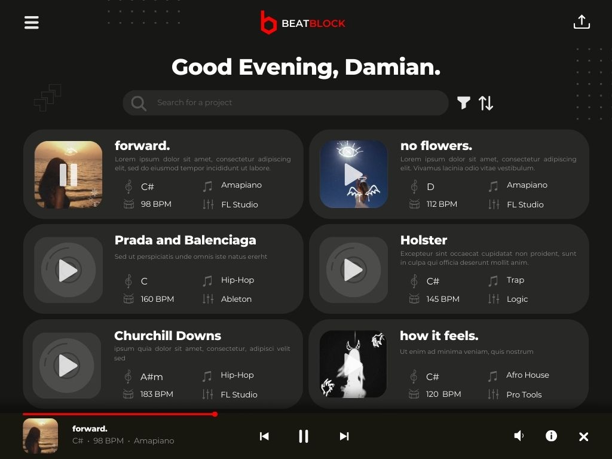
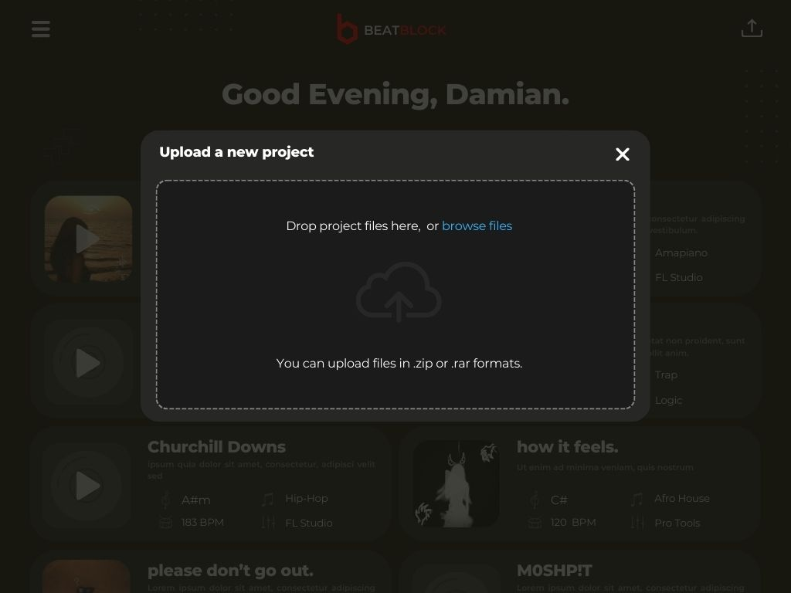
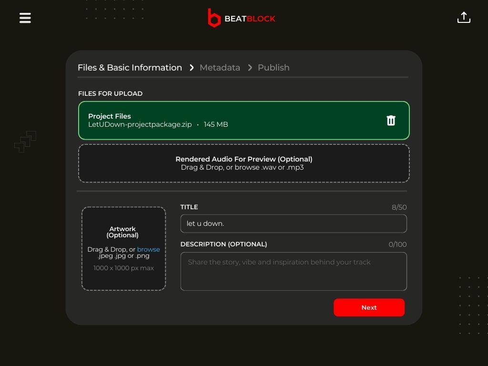
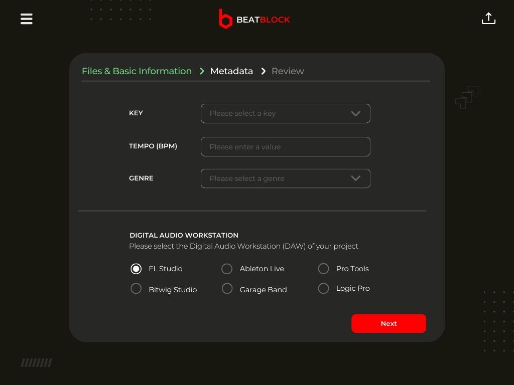
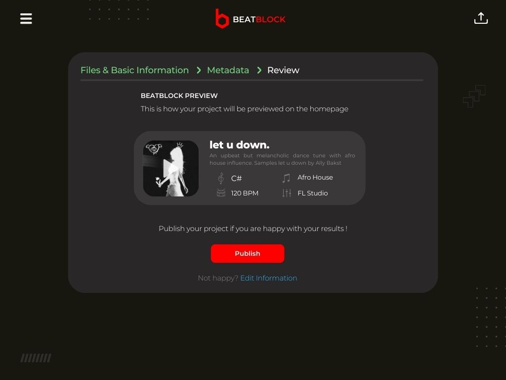

# UI Prototype

This document presents detailed mock-ups of the early concept for BeatBlock's user interface. To view the live prototype, click [here](https://www.canva.com/design/DAGmwF0sISA/Aul4Ar_KK9x8MDG4OVYMzw/view?mode=prototype)

Note: The live prototype link reflects the most up-to-date version. As a result, there may be differences between the content of the prototype and this document.

## Table of Contents

- [Sign-Up Page](#sign-up-page)
- [Login Page](#login-page)
- [Forgot Password Page](#forgot-password-page)
- [Home Page](#home-page)
- [Home Page with Media Player](#home-page-with-media-player)
- [Upload Modal](#upload-modal)
- [Files and Basic Information Capture Page](#files-and-basic-information-capture-page)
- [Metadata Capture Page](#metadata-capture-page)
- [Review and Publish Page](#review-and-publish-page)

### Sign-Up Page

### Login Page

### Forgot Password Page

### Home Page

### Home Page with Media Player

### Upload Modal

### Files and Basic Information Capture Page

### Metadata Capture Page

### Review and Publish Page

